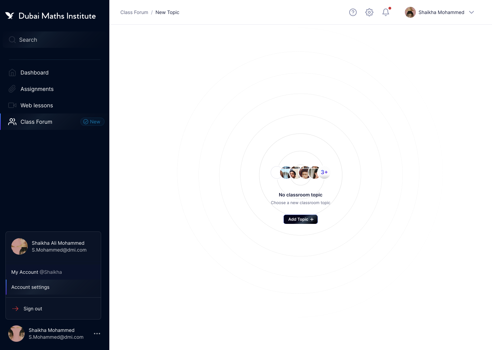

# DMI 📝

<!--  -->

<br>

## Table of Contents

- [DMI 📝](#dmi-)
  - [Table of Contents](#table-of-contents)
  - [Overview](#overview)

## Overview

<!-- GitHub-Finder is a Dockerized full stack MERN app built using `docker-dompose` and `Nginx` to leverage the `GitHub API` and returns Github user profiles, including their most recent repositories, followers, following, public gist, and location. Design, functionality, usability and intergration of containers and proxies were the main focus. -->

DMI is currently in beta. The app will allow users (students) to create their own learning curriculum revision and follow the recommended learning path to enhance their breath & depth of GCSE Higher Level maths. Students have access to an accompanying booklet with every question from every topic covered and a video walk-through.
Students can track progress, share it with friends and make changes as they go along - British Curriculum Examining Body Checklist: Edexcel AQA OCR (subtle differences that topics covered/not covered in each examining board - if students are short on time, they can rest assured they don’t have to go through that topic as the examining board doesn’t cover it.)

- Carefully crafted and sequenced curriculum, which runs through the academic year, offering a comprehensive program of study.
- UK-qualified and experienced Maths teachers from Russell Group universities, with a proven track record in leading UK and Dubai schools.
- Effective pedagogical practices and a whole class approach, focused on developing Mathematical thinking.
- We value quality over quantity, which is why we only teach the British Curriculum Mathematics courses, geared towards students in years 10 - 13.
- A web learning platform that works hand in glove with the content taught.

Full design work can be found on behance.

<!-- <a href="https://www.behance.net/portfolio/editor?project_id=164626013"  target="_blank"></a> -->

<br>

<!-- ## Technical Architecture Diagram -->

<!-- [][romie] -->

<!-- ## Technologies Used -->

<!-- ### Current Pages -->

<!-- Student page


<br>

Web Lesson
 -->

<!-- Clone the repo and make sure you have the following installed on your machine:

```
  Node.js
  npm
  Docker

``` -->
